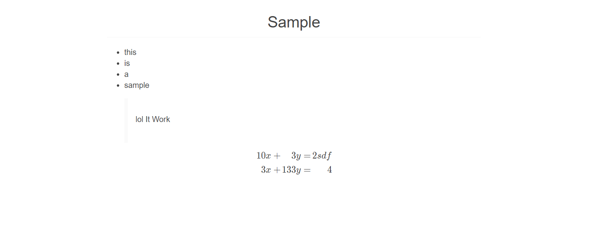
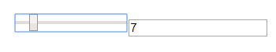
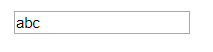

## Index
 1. [Info Section](#infosection)
 2. [Value Selector](#valueselector)
 3. [Input Field](#inputfield)

## InfoSection
--------------
Render Markdown content with katex (Texmath) support

```typescript
export interface Sources{
  DOM:DOMSource
  props:{
      source: string
  }
}

export interface Sinks{
  DOM:O<VNode>
}
```

`props.source` : markdown file location



## ValueSelector
----------------
Number value selector

```typescript
export interface Sources{
  DOM:DOMSource
  props:{
    min:number;
    max:number;
    default:number;
  }
}

export interface Sinks{
  DOM:O<VNode>
}
```



## InputField
-------------
Simple input Field

```typescript
export interface Sources{
  DOM:DOMSource
  props:O<{
    name:string;
    type:string;
    propList?:{[propName:string]:string}
  }>
}

export interface Sinks{
  DOM:O<VNode>
  value:O<string>
}
```
