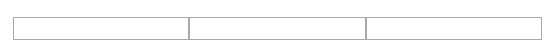
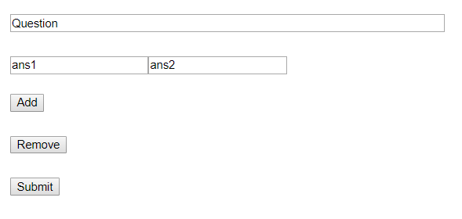

## Index
 1. [Info Section](#infosection)
 2. [Value Selector](#valueselector)
 3. [Input Field](#inputfield)
 4. [Input Array](#inputarray)
 5. [Questionaire](#questionaire)

## InfoSection
--------------
Render Markdown content with katex (Texmath) support

```typescript
export interface Sources{
  DOM:DOMSource
  props:{
      source: string
  }
}

export interface Sinks{
  DOM:O<VNode>
}
```

`props.source` : markdown file location


## ValueSelector
----------------
Number value selector

```typescript
export interface Sources{
  DOM:DOMSource
  props:{
    min:number;
    max:number;
    default:number;
  }
}

export interface Sinks{
  DOM:O<VNode>
}
```


## InputField
-------------
Simple input Field\
Support TextArea \

```typescript
export interface Sources{
  DOM:DOMSource
  props:O<{
    name:string;
    type:string;
    propList?:{[propName:string]:string};
  }>
  initialValue?:string
}

export interface Sinks{
  DOM:O<VNode>
  value:O<string>
}
```
> value stream for button is ['1','1','1']


## InputArray
-------------
Array of any input type from `size` and `type` observable with optional className\

```typescript
export interface Sources{
  DOM:DOMSource;
  size:O<number>;
  type:O<string>;
  className?:string;
}

export interface Sinks{
  DOM:O<VNode>;
  value:O<string[]>
}
```



## Questionaire
---------------
WIP WIP WIP WIP WIP WIP \
Question Creator

```typescript
export interface Sources{
  DOM:DOMSource
}

export interface Sinks{
  DOM:O<VNode>
}
```

